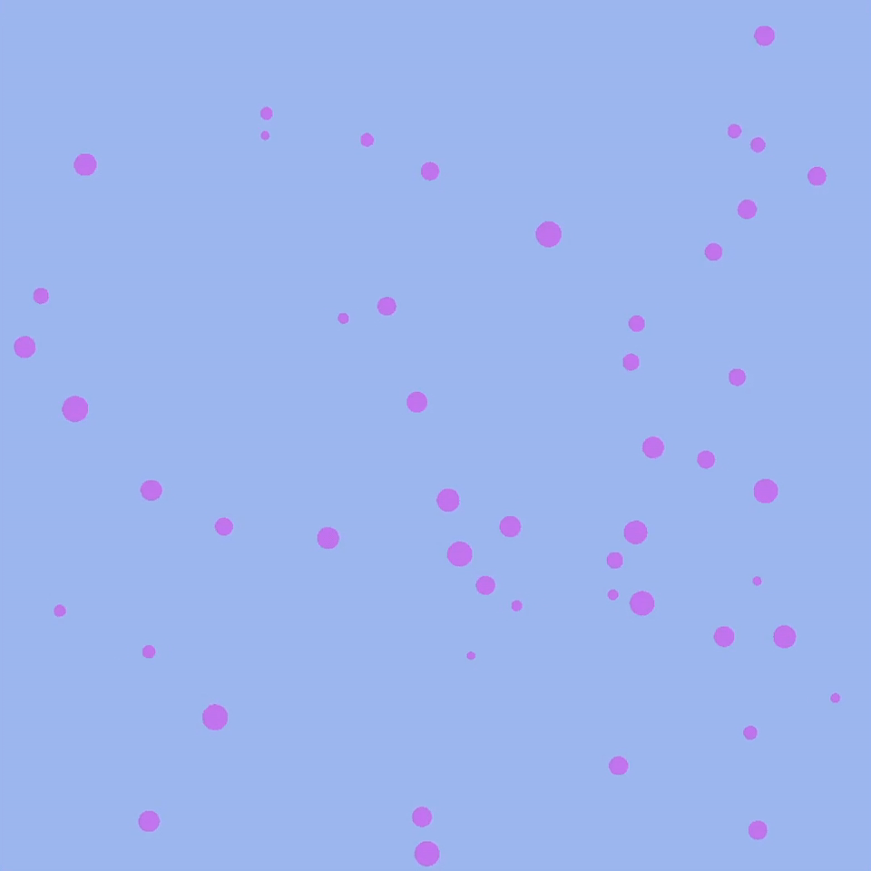

# 2D Particle Simulator

A real-time 2D particle physics simulator built in C++ using OpenGL and GLFW, featuring custom collision detection, collision response, and GPU-based rendering.

## Demo

<table>
  <tr>
    <th align="center">50 Circles</th>
    <th align="center">100 Circles</th>
    <th align="center">800 Circles</th>
  </tr>
  <tr>
    <td align="center">
      
    </td>
    <td align="center">
      
    </td>
    <td align="center">
      
    </td>
  </tr>
</table>
(Quality slightly diminished to stay within github's 100mb file limit)

## Features

- Simulates up to 800 moving particles in real time
- Implements particle-to-particle and wall collision detection
- Resolves collisions using vector-based physics
- Renders each circle from scratch as a triangle fan composed of 50 triangles
- Uses OpenGL shaders and GPU rendering for drawing and animation

## Technologies

- C++
- OpenGL
- GLFW
- GLSL

## How It Works

Each particle has a position and velocity that are updated every frame.

The program checks particles for collisions and calculates updated velocities when collisions occur. The resulting particle positions are then rendered using OpenGL.

## What I Learned

This project gave me experience with:

- Real-time graphics programming
- Collision detection and response
- Vector mathematics
- OpenGL rendering
- Shader programming
- C++ project organization
